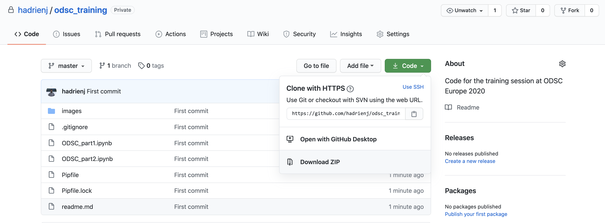

# Background

Here are the companion notebooks of my training session at the [Open Data Science Conference (ODSC)](https://odsc.com/europe/) (14th June 2022).

Programming is a great way to get practical insights about math theoretical concepts. The goal of this session is to show you that you can start learning the math needed for machine learning and data science using code. You'll learn about scalars, vectors, matrices and tensors, and see how to use linear algebra on your data.

This content is inspired from my book [Essential Math for Data Science](https://www.essentialmathfordatascience.com/).

# Setup

Here are the steps to do to follow the session using the Jupyter notebooks. This will allow you to do the exercises.

## Python

First, check that you have Python installed on your computer. Open a terminal and run:

```
python --version
```

If Python 3 is installed, it should return, for instance, `python 3.7.6`. If not, here are the steps to install it:

- Install Brew:

```
/usr/bin/ruby -e "$(curl -fsSL https://raw.githubusercontent.com/Homebrew/install/master/install)"
```

- Install Python

```
brew install python
```

You can check that Python 3 is now installed:

```
python --version
```

## Virtual environment

Next, you'll install virtual environments. Virtual environments are used to install specific Python libraries (and specific versions) for a project. This avoids conflict if you need different versions of Python or of libraries in two projects.

- Install pipenv:

```
brew install pipenv
```

Check that it worked:

```
pipenv --version
```

## Get the Notebooks

Download the Github repository that contains the notebooks at this address: https://github.com/hadrienj/odsc_training.


Click the 'clone' button and then download the `.zip`.


Unzip the file, open a terminal and go to that folder (replace with the correct path):

```
cd path/to/your/repo
```

Now, you can create a virtual environment with Python 3.7 for the project:

```
pipenv --python 3.7
```

Then, install the required libraries:

```
pipenv install
```

This line will install all the libraries listed in the file `Pipfile.lock`.

Finally, you can start the notebook server (from the virtual environment `pipenv`) as following:

```
pipenv run jupyter notebook
```

It should start a web page listing the files in the repository. You can then open the notebook you want (the `.ipynb` files).
